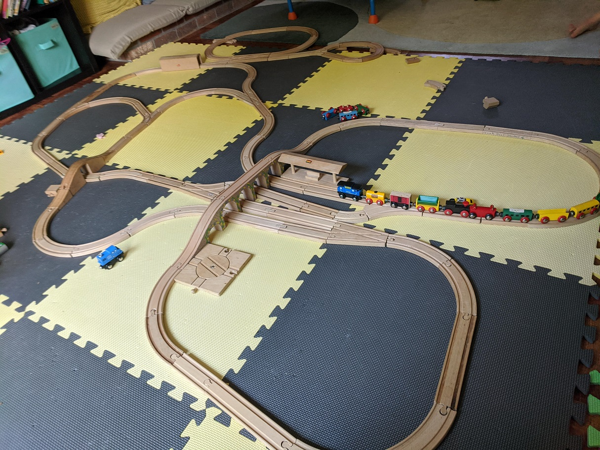
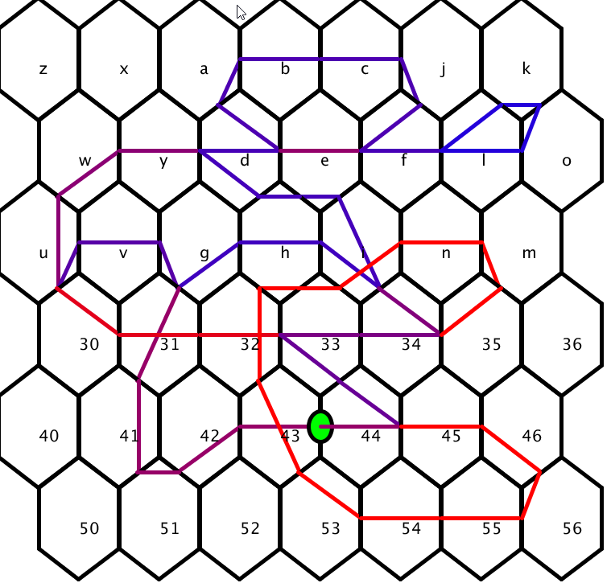

# Gordon
    [gordon "0.1.0"]

A Clojure utility for analyzing the correctness of wooden train track configurations. Often (when you let a child build) the track is designed such that trains cannot reach all points of the track or cannot change directions. The goal of Gordan is to analyze your track for optimal fun.  
Future improvements include: Usage analysis (are trains running into each other too much?), and automatic track generation using image recognition.

Built using [Ubergraph](https://github.com/Engelberg/ubergraph), [Loom](https://github.com/aysylu/loom) , and [Quil](https://github.com/quil/quil).

## Usage
### Buliding a track
Clone and fire up ```lein repl```  
Open ```src/gordon/core.clj``` and evaluate it.  
This opens two applets, one showing the train driving the tracks, the other the completed heat map.  
You can find additional tracks in ```data.clj``` or build your own.

### Track Analysis
Once you're happy with your track, you can turn it into an [Ubergraph](https://github.com/Engelberg/ubergraph):
``` clojure 
(def my-graph (track->graph my-track)
```  
Some things you can learn:  
Can you change directions?  
``` clojure
(uber/connected? my-graph)
```

Can you get everywhere?  
``` clojure
(uber/scc my-graph
```
Look for having a single component. Multiple components indicates you can get stuck in one direction.

Explore [Ubergraph](https://github.com/Engelberg/ubergraph)/[Loom](https://github.com/aysylu/loom) algorithms for other interesting properties (what does shortest path tell you about your track?).

### Visualize
Since Gordon is built on [Ubergraph](https://github.com/Engelberg/ubergraph) (which is built on Loom), we can export to [GraphViz](https://graphviz.org/).
Draw using [GraphViz](https://graphviz.org/) (must be installed):
``` clojure
(viz-track my-track)
```

Export the [GraphViz](https://graphviz.org/) ".dot" file:  
``` clojure
(track->dot my-track "my-track.dot")
```

## Example
Here is the output for a track with an outer loop and a cross section. If you are going clockwise on the outer loop, you cannot get to the cross section. If you are going clockwise on the outer loop, taking the cross section changes you to clockwise and you cannot take the cross section a second time. The graph of this track is connected, but not strongly connected (scc will return multiple components). Looking at the [GraphViz](https://graphviz.org/) visualization, you can see that the graph gets stuck at ```:cf``` and ```:hd```.  

| Real Track | Drawn Track | Graph |
:-----------:|:-----------:|:-----:
||||
||||
||||


You can also analyze your track for 'hot spots' that may cause bottlenecks (and arguments).
| Real Track | Driving | Result |
:-----------:|:-------:|:------:
| | | 

## License

Distributed under the Eclipse Public License either version 1.0 or (at
your option) any later version.
